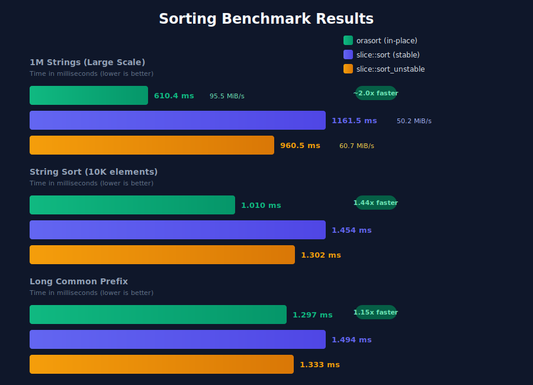

<h1 align="center">Orasort</h1>
<p align="center">
  <b>High-performance, cache-efficient sorting library optimized for common prefixes.</b>
</p>

<p align="center">
  <a href="LICENSE"></a>
  <a href="https://github.com/psila-ai/orasort/actions"></a>
  <a href="https://www.rust-lang.org"></a>
</p>

<br>

`orasort` is a high-performance, cache-efficient sorting library designed specifically for strings, byte arrays, and other data types that share common prefixes.

It implements the **Orasort** sorting algorithm, which combines the strengths of **Quicksort** and **Radix Sort** while optimizing for modern CPU architectures by minimizing memory accesses and maximizing cache locality.

## Usage

Add this to your `Cargo.toml`:

```toml
[dependencies]
orasort = "0.1"
```

### Basic Usage

```rust
use orasort::orasort_mut;

let mut data = vec!["banana", "apple", "cherry", "date"];
orasort_mut(&mut data);

assert_eq!(data, vec!["apple", "banana", "cherry", "date"]);
```

### Custom Types

To sort custom types or complex data structures without creating intermediate strings, implement the `KeyAccessor` trait.

```rust
use orasort::{orasort, KeyAccessor};

struct Users {
    names: Vec<String>,
}

impl KeyAccessor for Users {
    fn get_key(&self, index: usize) -> &[u8] {
        self.names[index].as_bytes()
    }

    fn len(&self) -> usize {
        self.names.len()
    }
}
```

## Performance

`orasort` is particularly effective for datasets where cache misses are the primary bottleneck, such as sorting large arrays of data.

Benchmarks on **1,000,000 random strings** show significant improvements over `std::sort` due to reduced cache pressure.

**System Specifications:**
- **CPU:** Intel(R) Xeon(R) W-2295 CPU @ 3.00GHz (18 cores, 36 threads)
- **Memory:** 192Gi (DDR4)

**Results (1M Strings) [Throughput]:**
- **orasort (in-place)**: `~95.5 MiB/s` (610ms)
- **slice::sort (stable)**: `~50.2 MiB/s` (1161ms) -> Orasort is **~90% faster**.
- **slice::sort_unstable**: `~60.7 MiB/s` (960ms) -> Orasort is **~58% faster**.



This advantage comes from the "Key Substring Caching" strategy, which avoids dereferencing pointers for most comparisons, keeping the hot path entirely within cpu registers/L1 cache.

> **NOTE**: Benchmarks are highly dependent on hardware, data distribution, and memory architecture. We strongly recommend running benchmarks on your own target systems to verify performance gains for your specific use cases.


## License

Licensed under either of

 * Apache License, Version 2.0
   ([LICENSE-APACHE](LICENSE-APACHE) or http://www.apache.org/licenses/LICENSE-2.0)
 * MIT license
   ([LICENSE-MIT](LICENSE-MIT) or http://opensource.org/licenses/MIT)

at your option.

## Contribution

Unless you explicitly state otherwise, any contribution intentionally submitted
for inclusion in the work by you, as defined in the Apache-2.0 license, shall be
dual licensed as above, without any additional terms or conditions.
